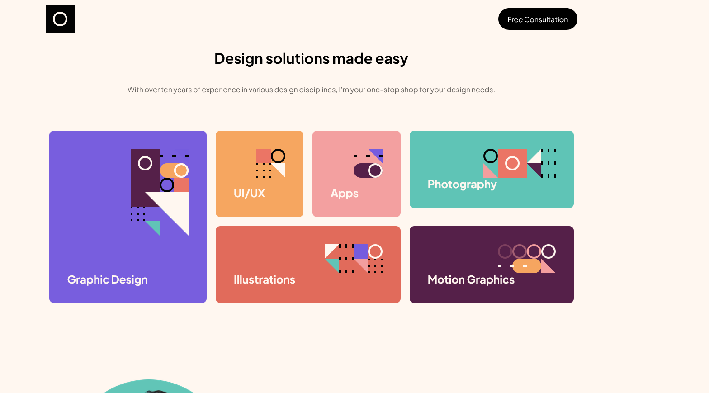

# Frontend Mentor - Single-page design portfolio

## Welcome! 👋

## Deploying your project

As mentioned above, there are many ways to host your project for free. Our recommended hosts are:

- GitHub Pages:https://github.com/cgojk/design_portfolio.git
- Vercel:https://design-portfolio-mocha.vercel.app/

## What I learned

During this project I improved my skills in building responsive React applications and creating reusable components.

### React

- Built reusable components for different sections of the website.
- Used React state (`useState`) to control carousel navigation.
- Used `useEffect` for automatic carousel rotation.
- Used React Router with a shared layout structure using `Outlet`.
- Created reusable Navigation and Footer components.

### Responsive Design

- Created layouts for mobile, tablet, and desktop breakpoints.
- Used CSS Grid and Flexbox to build responsive sections.
- Learned when to use fixed values, percentages, `max-width`, and media queries.
- Improved spacing management between sections uing clamp.

### Styling

- Organized styles using SCSS.
- Used nested selectors to keep component styles organized.
- Added transitions and hover animations to improve user interaction.
- Created responsive image containers that adapt to different screen sizes.

### Carousel

- Built a custom image carousel without external libraries.
- Added previous and next controls.
- Added automatic rotation.
- Created different layouts for desktop and smaller screens.

### Deployment

- Deployed the project using Vercel.
- Learned about production builds and SPA routing configuration.

## Challenges

Some of the main challenges were:

- Creating a responsive carousel that behaves differently on mobile and desktop.
- Keeping the footer fixed at the bottom without creating unwanted spacing.
- Managing responsive image sizes without making images too large on bigger screens.
- Structuring the application layout correctly using React Router.
